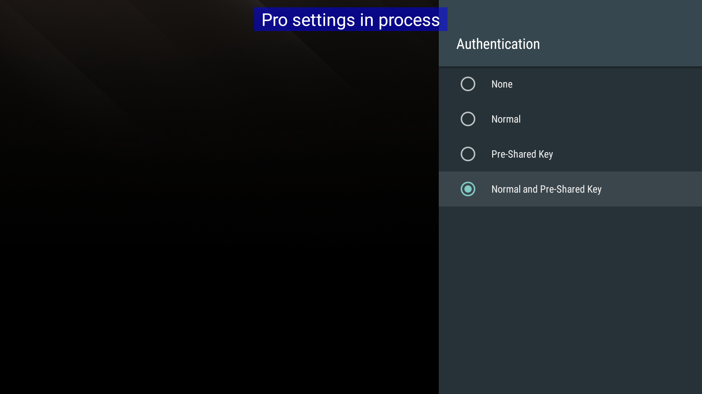
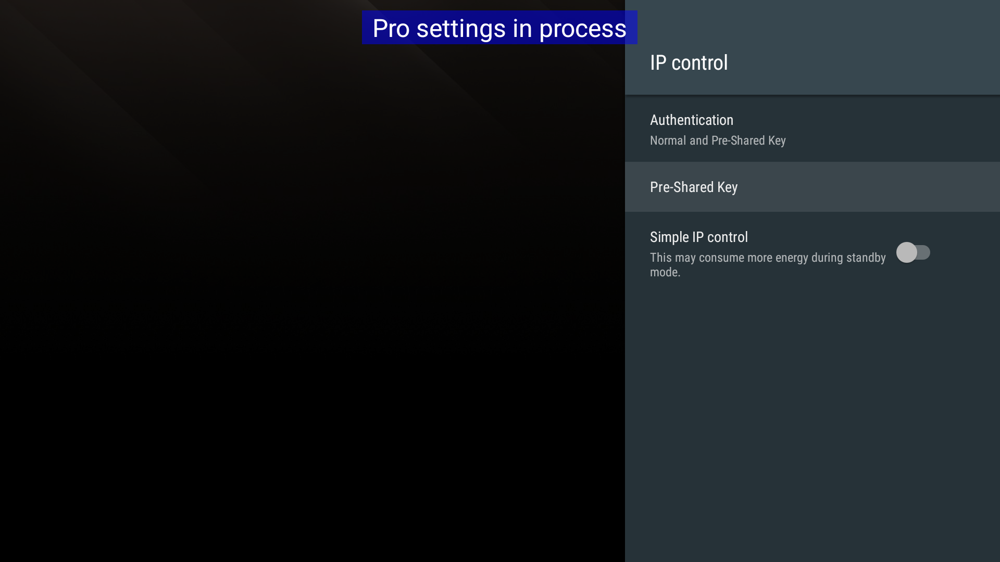

## Setup

Frist of all, make sure your TV and iPhone are in the same WiFi network.

### Remote Start

If you'd like `Remote for BRAVIA TV` to control the power / sleep of your TV. You need to turn the `Remote Start` option ON.

**On Your TV**

- Set Remote start to ON 
  
  [Home] Settings > Network > Remote Start
  
### Check Your TV's Host Name / IP Address

For the Remote app to find your TV, you need to tell it the host name, typcally the IP address of your TV.

**On Your TV**

- Check IP Address of BRAVIA TV

  [HOME] Settings > Network > Advanced settings > Network status > IP address

*If you cannot find the options in your `Settings` menu. You may need to enable [Pro settings mode](https://pro-bravia.sony.net/guides/mode/index.html).*

**In the App**

Fill your TV's `IP address` to the `HOST NAME / IP` field.

### Setup a Pre-Shared Key (PSK)

For the Remote app to securely communicate with your TV. You need to setup a Pre-Shared Key (a.k.a PSK).

**On Your TV**

- Change Authentication to Normal and Pre-Shared Key 
    
  [Home] Settings > Network > IP Control > Authentication

  

- Enter a Pre-Shared Key
    
  [Home] Settings > Network > IP Control > Pre-Shared Key

  

*If you cannot find the options in your `Settings` menu. You may need to enable [Pro settings mode](https://pro-bravia.sony.net/guides/mode/index.html).*

**In the App**

Fill your TV's `Pre-Shared Key` to the `PRE-SHARED KEY` field.

### Test Your Setup

**In the App**

Open `Settings` (The upper left icon on the app's main screen)

Tap the `Toggle TV Power` button on the bottom of the list.

## x-callback-url

Remote for BRAVIA TV supports x-callback-url, allowing the calling app to receive a response (a callback) when a particular interaction has completed.

Here’s an example for sending IRCC code:

```
bravia-remote://x-callback-url/send?code=...&repeat=...
```

The following parameters can be provided:

- `name`: Name of the IR command you'd like to send.

- `code`: Code of the IR command you'd like to send.

- `repeat`: How many times you'd like to send the command.

A table of IR code and name can be found here: https://pro-bravia.sony.net/develop/integrate/ircc-ip/ircc-codes/index.html

Per the x-callback-url standard, the following additional parameters can be provided:

- `x-success` (optional): A URL that opens when the interaction is successful.

- `x-error` (optional): A URL that opens when the interaction fails because an error occurred.

Here are some examples:

`bravia-remote://x-callback-url/send?name=power`

`bravia-remote://x-callback-url/send?name=volumeup`

`bravia-remote://x-callback-url/send?name=home`

## Working with the Shortcuts App

You can use the "X-Callback URL" action in the "Shortcuts" to control your TV. 

Here are some examples:

[TV Power](https://www.icloud.com/shortcuts/c6b92f40c7e54fa9a9c37ca2a6690b17)

[Volume Up](https://www.icloud.com/shortcuts/580a1266978e4caa96a3c3f9027b6d89)

[Volume Down](https://www.icloud.com/shortcuts/e7322f800ce5424ba90c04f75befe024)

[Switch to HDMI 1](https://www.icloud.com/shortcuts/cfb22992f3d64da8a6b17b76232e485b)

## Privacy Policy

We don’t store any your data, period.

What happens on your device stays on your device.

---

*\* BRAVIA is a trademark of Sony Visual Products Inc.*
